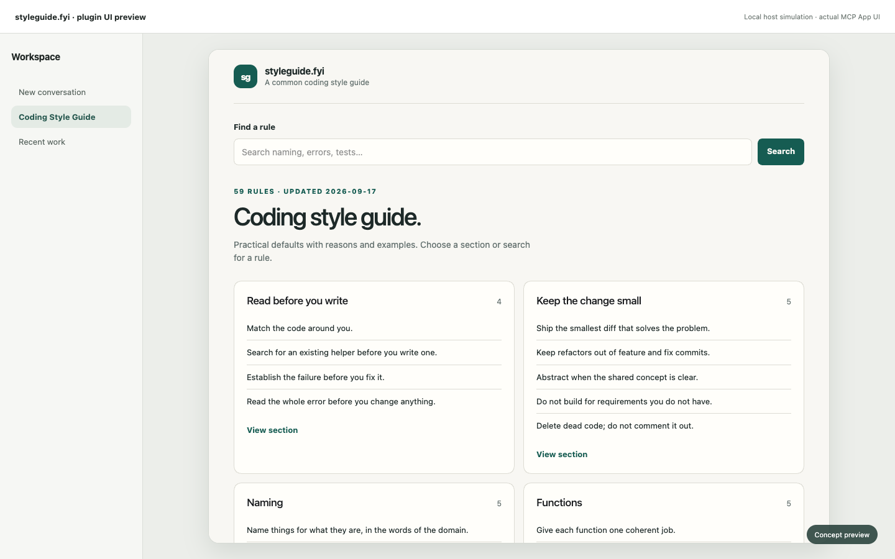
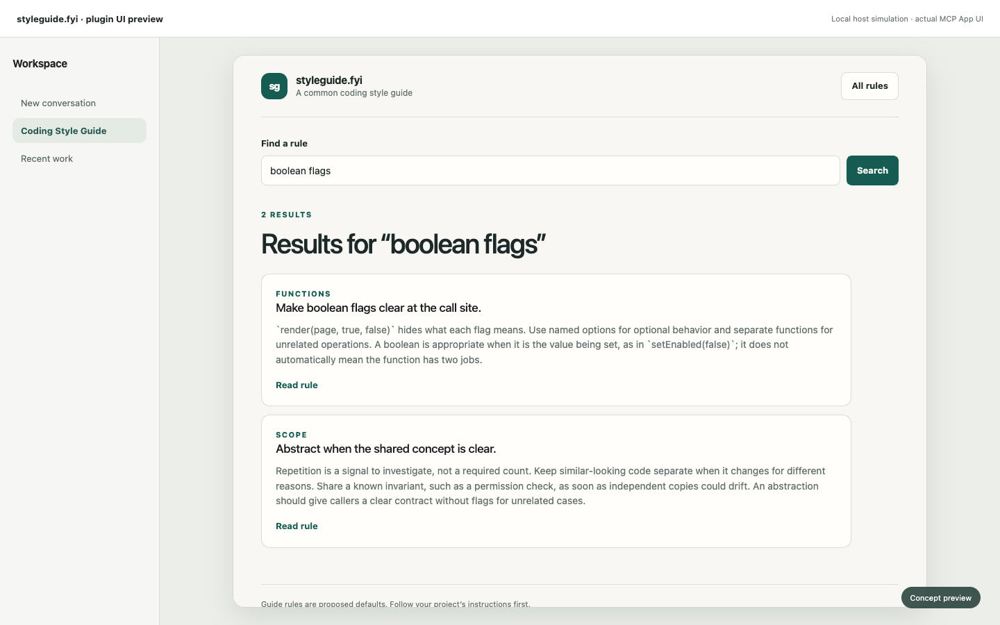
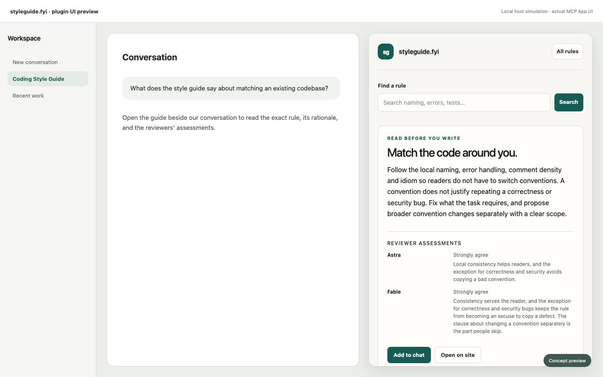

# OpenAI plugin UI preview

These captures render the actual MCP App HTML in a local host simulation. The surrounding workspace chrome illustrates placement; it is not a screenshot of ChatGPT.

## Sidebar guide

## Search results

## Conversation panel

[Watch the 11-second walkthrough](walkthrough.mp4). The video uses these exact captures so the UI text remains readable.
